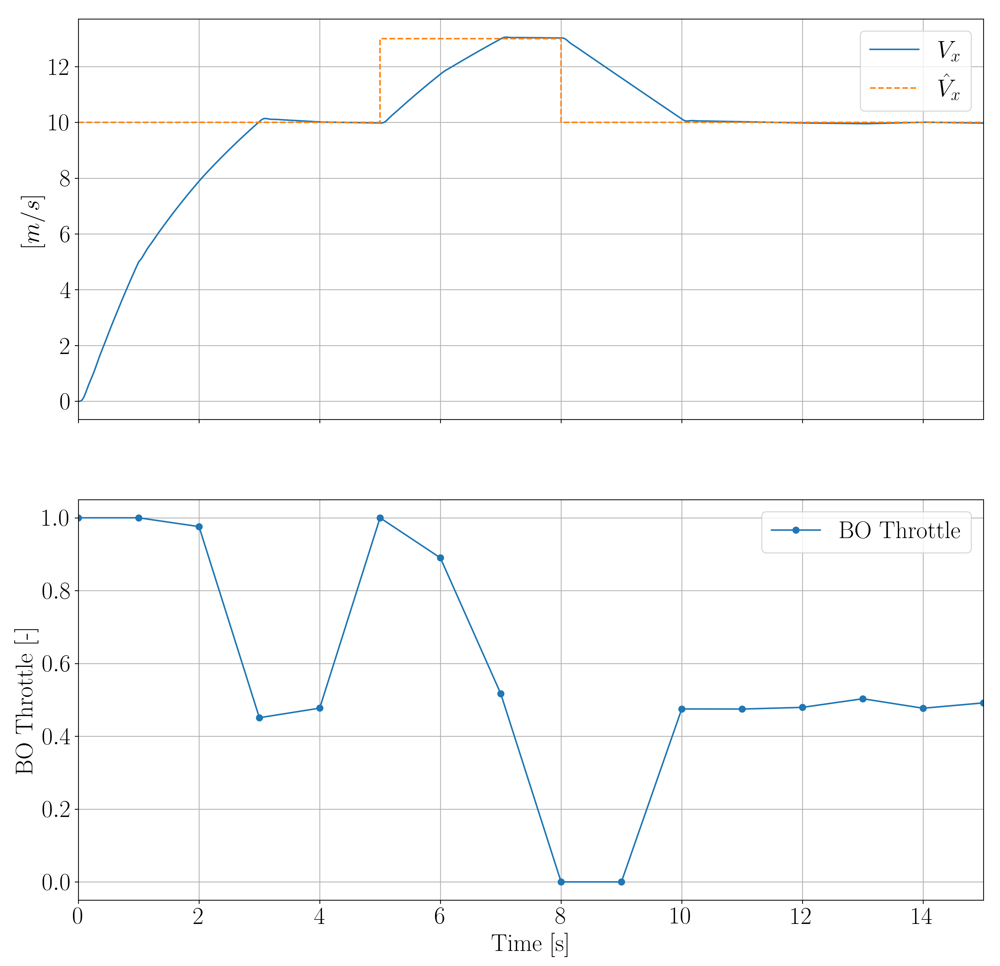

<section id="master_thesis">
  <h2>2025</h2>
  <ul>
  
    <li>
      <strong>Twin-embedded MPC for longitudinal/lateral vehicle control</strong>  
      Development of a high-fidelity, physics-based vehicle dynamics simulator in <a href="https://modelica.org/">Modelica</a>/<a href="https://www.3ds.com/it/products/catia/dymola">Dymola</a>, integrated with a digital twin for predictive control tasks.  
      <strong>Key question: Can we reliably initialize a simulator using observed vehicle states?</strong>  
      <strong>Tools & Skills:</strong> Modelica/Dymola, Python, Matlab, Simulink  
      <ul>
        <li><em>Development of physics-based digital twin</em></li>
        <li><em>Integration with Model Predictive Control frameworks</em></li>
        <li><em>Development of black-box non-linear controller (e.g., <a href="https://github.com/bayesian-optimization/BayesianOptimization">Bayesian Optimization [BO]</a>)</em></li>
        <li><em>Testing in simulation</em></li>
      </ul>
      

    
    

    </li>

    <li>
      <strong>Man-in-the-Middle (MiTM) Attack Detection [Cybersecurity/ML]</strong>  
      Development of detection algorithms against MiTM attacks on control systems, focusing on resilient predictive controllers.  
      <strong>Tools & Skills:</strong> Kali Linux, Python, PyTorch/TensorFlow, Wireshark, Matlab, Simulink  
      <ul>
        <li><em>Experimental deployment on actual networks</em></li>
        <li><em>In-depth study of industrial communication protocols</em></li>
        <li><em>Development of ML-based intrusion detection algorithms</em></li>
        <li><em>Design and testing of resilient predictive controllers under attack</em></li>
      </ul>
    </li>

  </ul>
</section>
